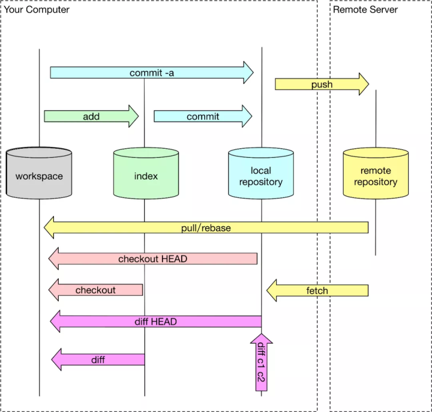

# 版本控制工具 Git

版本控制可以记录文件的变化，方便快捷的查看、回退指定版本的内容。

## Git 生命周期

随着使用你会渐渐加深对其生命周期的理解。


Git 仓库中，工作目录下的每一个文件不外乎两种状态：未跟踪（Untracked）或已跟踪（Tracked）。

已跟踪的文件是指那些被纳入了版本控制的文件，在上一次快照中有它们的记录，在工作一段时间后，它们的状态可能处于未修改，已修改或存入暂存区。

工作目录中除已跟踪文件以外都属于未跟踪文件，它们即不存在于上次快照的记录中，也没有放入暂存区。

初次克隆某个仓库时，工作目录中所有的文件都属于已跟踪文件，并处于未修改状态。

## Git 状态模型

在状态模型中进行了更详细的说明。



关于上图一些概念的说明。

### 1. 工作区（workspace）

当前工作空间，即当前能在本地文件夹下面可以看到的文件结构。初始化工作空间或者工作空间 `clean` 的时候，文件内容和暂存区（index）是一致的，随着修改，工作区文件没有执行 `git add` 到暂存区的时候，工作区域将和暂存区不一致。

```bash
# clean 状态
$ git status

#On branch master
#nothing to commit, working tree clean
```

### 2. 暂存区（index）

老版本的概念也叫 Cache 区，就是文件暂时存放的地方，所有暂时存放在暂存区中的文件将随着 `git commit` 一起提交到本地仓库（local repository），此时本地仓库的文件将会被暂存区所取代。

### 3. 本地仓库（local repository）

git 是分布式版本控制系统，和其他版本控制系统不同的是他可以完全去中心化操作，你可以不用和远程仓库（remote repository）进行通信，在本地即可进行全部离线操作，包括 log、history、commit、diff 等。

能实现以上功能是由于 git 有一个几乎和远程一样的本地仓库。

所以离线操作都可以本地完成，等需要的时候再和远程仓库进行交互。

### 4. 远程仓库（remote repository）

远程中心仓库，可使得仓库分享给其他人。结构大体和本地仓库一样。

## Git 常用命令

Git 的操作指令非常多，此处仅选一些简单的日常操作。

### 查看帮助

所有命令行最重要的当然是查看帮助文档：

```bash
git help
```

结果：

```vim
用法：git [--version] [--help] [-C <路径>] [-c <名称>=<取值>]
           [--exec-path[=<路径>]] [--html-path] [--man-path] [--info-path]
           [-p | --paginate | -P | --no-pager] [--no-replace-objects] [--bare]
           [--git-dir=<路径>] [--work-tree=<路径>] [--namespace=<名称>]
           <命令> [<参数>]

这些是各种场合常见的 Git 命令：

开始一个工作区（参见：git help tutorial）
   clone      克隆仓库到一个新目录
   init       创建一个空的 Git 仓库或重新初始化一个已存在的仓库

在当前变更上工作（参见：git help everyday）
   add        添加文件内容至索引
   mv         移动或重命名一个文件、目录或符号链接
   reset      重置当前 HEAD 到指定状态
   rm         从工作区和索引中删除文件

检查历史和状态（参见：git help revisions）
   bisect     通过二分查找定位引入 bug 的提交
   grep       输出和模式匹配的行
   log        显示提交日志
   show       显示各种类型的对象
   status     显示工作区状态

扩展、标记和调校您的历史记录
   branch     列出、创建或删除分支
   checkout   切换分支或恢复工作区文件
   commit     记录变更到仓库
   diff       显示提交之间、提交和工作区之间等的差异
   merge      合并两个或更多开发历史
   rebase     在另一个分支上重新应用提交
   tag        创建、列出、删除或校验一个 GPG 签名的标签对象

协同（参见：git help workflows）
   fetch      从另外一个仓库下载对象和引用
   pull       获取并整合另外的仓库或一个本地分支
   push       更新远程引用和相关的对象

命令 'git help -a' 和 'git help -g' 显示可用的子命令和一些概念帮助。
查看 'git help <命令>' 或 'git help <概念>' 以获取给定子命令或概念的
帮助。
```

### 简单使用

```bash
# 检查文件是否有更新
git status

# 将新增的文件进行跟踪
git add .

# 提交本次修改内容（请尽量详细），方便日后修改 bug 时快速定位
# 此处 commit 仅为示例，请修改为你项目的提交信息
git commit  -m"docs(git): 新增 git 简单使用"

# 提交到仓库
git push
```

### 统计信息

```bash
# 所有分支指定用户指定时间范围提交信息
# 更多的 formats 可见 https://git-scm.com/docs/pretty-formats
git log --all --author="你的名称" --after="2022-07-16" --before="2022-07-23" --no-merges --pretty=format:"%an(%ae) %as: %s"
```

### Git 飞行规则

[Git飞行规则(Flight Rules)](https://github.com/k88hudson/git-flight-rules/blob/master/README_zh-CN.md) 可以用来指导一些常见的问题。

## 为 Git 添加代理

clone 大项目时总是乏力，下载速度极慢，这时就需要为其设置代理了。

### 全局代理

该项可参考 alias 部分内容。

```bash
gfw
```

### Git 代理

在 Git 官网可获得提示 `http.proxy`，虽然在其余地方搜索还得到提示 `https.proxy`，但在官网并没有搜到对应内容，怀疑是误传。

```bash
# 设置代理 
git config --global http.proxy 'socks5://127.0.0.1:1080'
# 取消代理
git config --global --unset http.proxy

# 更好的形式当然是设置为 alias
alias proxygit="git config --global http.proxy socks5://127.0.0.1:1080"
alias uproxygit="git config --global --unset http.proxy"
```

### Git 代理协议的补充

git 代理支持多种协议：http、https、socks、socks5，本机通过 ss 启用了 socks5。

## 参考资料

+ [Github](https://help.github.com/en)
+ [Git-scm](https://git-scm.com/book/zh/v2)
+ [shafiul Community Book](https://shafiul.github.io/gitbook/index.html)
